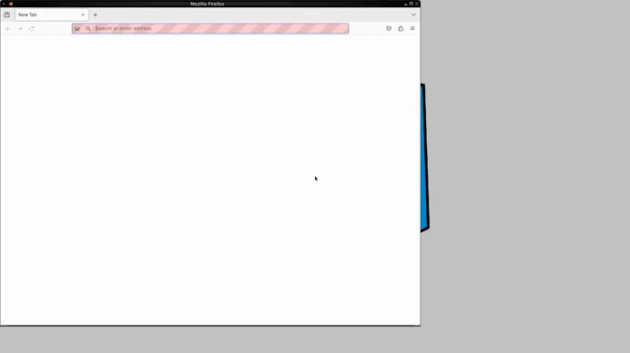

# Проект по автоматизации тестирования для компании [BORK](https://www.bork.ru/)

---
##  **Содержание:**

---

* [Технологии и инструменты](#технологии-и-инструменты)
* [Примеры автоматизированных тестов](#список-проверок)
* [Запуск тестов - сборка в Jenkins](#-запуск-тестов---сборка-в-jenkins)
* [Allure Report](#--allure-report)
* [Уведомление в Telegram о результатах тестов](#-уведомление-в-telegram-о-результатах-тестов)
* [Видео прохождение тестов на Selenoid](#-видео-прохождение-тестов-на-selenoid)


## Технологии и инструменты:

---


<p align="center">  
<a href="https://www.jetbrains.com/idea/"></a>  
<a href="https://www.java.com/"></a>  
<a href="https://github.com/"></a>  
<a href="https://junit.org/junit5/"></a>  
<a href="https://gradle.org/"></a>  
<a href="https://selenide.org/"></a>  
<a href="https://aerokube.com/selenoid/"></a>
<a href="https://www.jenkins.io/"></a>
<a href="https://github.com/allure-framework/"></a>
</p>

---

## Примеры автоматизированных тестов:

---

- *Проверка содержания всех пунктов в хедере*
- *Проверка соответствия картинки и суммы подарочной карты*
- *Проверка кликабельности кнопки после ввода допустимого значения в поле суммы подарочной карты*
- *Проверка отображения ошибки при вводе недопустимого значения в поле суммы подарочной карты*
- *Проверка отображения искомой категории при вводе ключевого слова в поиск*

---

## Запуск тестов - сборка в Jenkins:

---

**Сборка в [Jenkins](https://jenkins.autotests.cloud/job/30-tinwhip-homework_fast_project/)**    
***Ключи, позволяющие запустить сборку с параметрами:***
- *browser (браузер, по умолчанию chrome)*
- *browserVersion (версия браузера, для каждого браузера перечислены соответствующие версии)*
- *browserSize (размер окна браузера, по умолчанию - 1920x1080)*
- *remoteUrl (адрес удаленного сервера Selenoid)*
- *auth (login:password для авторизации в Selenoid)*
- *testType (возможность выбора тестов с конкретным тэгом, либо выбор всех тестов для запуска)*

## Команды для запуска из терминала
___
***Локальный запуск:***
```bash  
gradle clean test
```

***Удалённый запуск через Jenkins:***
```bash  
clean
${TESTTYPE}
-DremoteUrl=${REMOTEURL}
-Dauth=${AUTH}
-Dbrowser=${BROWSER}
-Dversion=${BROWSERVERSION}
-DbrowserSize=${BROWSERSIZE}
```

---
## Allure Report

---

## Основная страница отчёта  
***С инфомацией о количестве запущенных тестов, статусе прохождения и графика TREND, отображающего тенденцию прогона тестов***

<p align="center">  
  
</p>  

## Тест-кейсы.  
***Содержат подробное описание шагов со скриншотами, видео и Page Source по каждому тесту***

<p align="center">  
  
</p> 

---

## Уведомление в Telegram о результатах тестов
____

<p align="center">  
  
</p> 

## Пример видео выполнения теста на Selenoid
____
<p align="center">
   
</p>